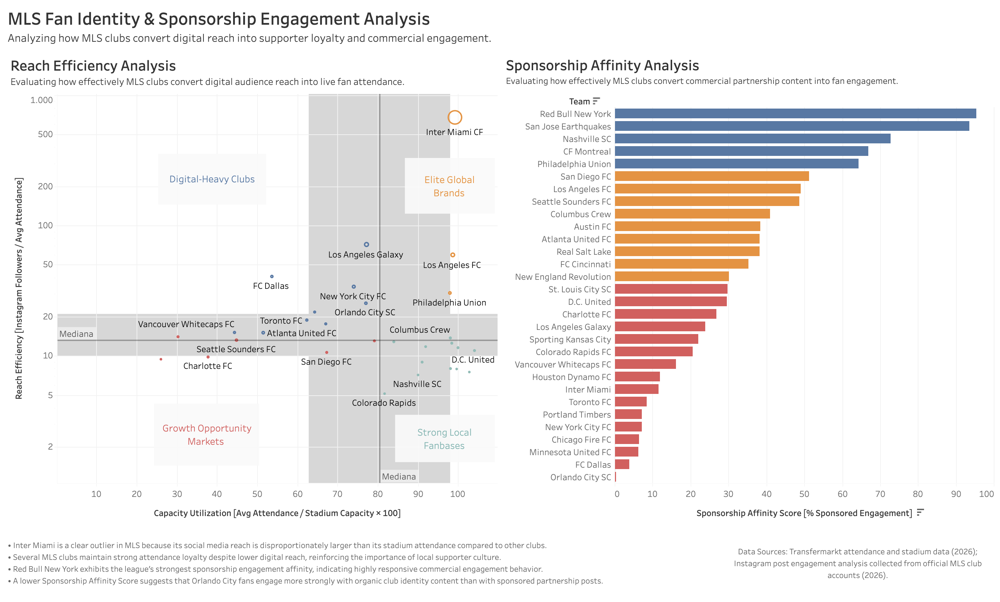

# MLS Fan Identity & Sponsorship Engagement Analysis

---

## Project Overview

This project analyzes how Major League Soccer (MLS) clubs convert digital attention into supporter loyalty, emotional club identity, and commercial sponsorship engagement.

The analysis explores the relationship between:

- Digital popularity
- Match attendance loyalty
- Supporter culture
- Sponsorship engagement behavior

Using attendance data, stadium utilization metrics, Instagram audience reach, and sponsorship engagement ratios, this project evaluates how different MLS clubs build fan identity through either:
- global star-driven visibility
- or strong local supporter culture

---

## Problem Statement

As MLS continues to grow digitally, many clubs still face challenges in transforming audience attention into long-term fan loyalty, supporter culture, and emotional identification with club values and identity.

While some clubs generate massive global visibility through celebrity players and digital reach, others maintain strong supporter loyalty through community identity and local fan culture.

This project investigates how different fan identity structures influence engagement behavior across MLS clubs.

---

## Main Hypothesis

Clubs with stronger emotional identity and supporter culture generate deeper fan loyalty than clubs relying primarily on digital popularity and star-driven visibility.

---

## Objectives

- Measure how efficiently MLS clubs convert digital reach into live attendance.
- Evaluate how fans engage with sponsorship content relative to organic club content.
- Identify clubs with stronger supporter culture versus commercially driven engagement behavior.
- Detect statistical outliers and unique fan identity models across MLS.

---

## Metrics Used

### Metric 1 — Reach Efficiency Analysis

**Business Question:**  
How effectively do MLS clubs convert digital audience reach into live fan attendance?

**Formula:**

```text
Reach Efficiency = Instagram Followers / Average Attendance
```

**Interpretation:**

A higher score indicates:
- stronger digital visibility relative to attendance
- global audience reach
- celebrity-driven attention

A lower score may indicate:
- stronger local attendance culture
- less dependence on digital popularity
- more community-oriented fan behavior

---

### Additional Variable — Capacity Utilization

**Formula:**

```text
Capacity Utilization = (Average Attendance / Stadium Capacity) × 100
```

**Measures:**
- stadium demand
- attendance consistency
- supporter loyalty
- matchday engagement strength

---

### Metric 2 — Sponsorship Affinity Analysis

**Business Question:**  
How effectively do MLS clubs convert sponsorship content into fan engagement?

**Formula:**

```text
Sponsorship Affinity Score =
Sponsored Avg / (Sponsored Avg + Organic Avg) × 100
```

---

### Formula Explanation

The formula compares sponsored engagement against total engagement.

First:
- Sponsored Avg + Organic Avg calculates total engagement activity.

Then:
- Sponsored Avg is divided by total engagement to normalize the result.

Finally:
- multiplying by 100 converts the ratio into a percentage for easier interpretation.

---

### Interpretation

Higher scores suggest:
- fans engage strongly with commercial sponsorship content
- sponsorships are effectively integrated into fan culture
- fans respond positively to branded activations

Lower scores suggest:
- fans prefer organic club identity content
- supporter culture may be more emotionally connected to non-commercial storytelling
- sponsorship integration may feel less authentic or less engaging

---

## Data Sources

| Variable | Source | Method |
|---|---|---|
| Instagram Followers | Instagram | Manual Collection |
| Sponsored & Organic Post Engagement | Official MLS Club Instagram Accounts | Manual Engagement Analysis |
| Average Attendance | Transfermarkt MLS Attendance Data | Python Web Scraping |
| Stadium Capacity | Transfermarkt MLS Attendance Data | Python Web Scraping |

Data collected during 2026 MLS season analysis.

---

## Tools & Technologies

- Python
- Pandas
- Jupyter Notebook
- Tableau Public
- SQL
- GitHub

---

## Repository Structure

```text
mls-fan-identity-analysis/
│
├── data/
│   ├── raw/                # Original source files ignored from GitHub
│   └── processed/          # Cleaned datasets
│
├── notebooks/
│   ├── metric1_star_power.ipynb
│   └── metric2_sponsorship_affinity.ipynb
│
├── sql/
│   └── metric2_queries.sql
│
├── visuals/
│   ├── dashboard_final.png
│   ├── metric1_reach_efficiency.png
│   └── metric2_sponsorship_affinity.png
│
├── README.md
├── requirements.txt
└── .gitignore
```

---

## Dashboard Overview

The Tableau dashboard combines:

- Reach Efficiency Analysis
- Sponsorship Affinity Analysis
- Fan Identity Quadrants
- Commercial Engagement Segmentation

The dashboard identifies:

- Elite Global Brands
- Digital-Heavy Clubs
- Strong Local Fanbases
- Growth Opportunity Markets

---

## Key Findings

- Inter Miami is a clear statistical outlier because its social media reach is disproportionately larger than its stadium attendance compared to other MLS clubs.

- Several MLS clubs maintain strong attendance loyalty despite lower digital reach, reinforcing the importance of supporter culture and local fan identity.

- Red Bull New York exhibits one of the league’s strongest sponsorship engagement affinity scores, indicating highly responsive commercial engagement behavior.

- Orlando City shows one of the lowest sponsorship affinity scores, suggesting fans engage more strongly with organic club identity content than with sponsored partnership posts.

- Different MLS clubs appear to build loyalty through different identity structures:
  - global visibility and celebrity branding
  - or strong community-driven supporter culture

---

## Recommendations

### Recommendation 1 — Integrate Sponsorships Into Organic Identity Moments

Clubs with strong organic engagement should integrate sponsorship activations naturally into identity-driven content such as:
- supporter culture
- matchday experiences
- community initiatives
- emotional storytelling
- club traditions

Rather than separating sponsorships from club identity, MLS organizations can improve fan engagement by embedding brands into authentic supporter experiences that align with club values and emotional fan culture.

---

### Recommendation 2 — Leverage Superstar Storytelling for Brand Integration

Clubs with global superstar players should integrate sponsorship storytelling around authentic player moments and emotional fan experiences.

Instead of relying only on celebrity visibility, organizations can connect:
- superstar personalities
- emotional match moments
- club identity narratives
- and brand partnerships

This may strengthen:
- fan identification with sponsors
- emotional engagement with branded content
- long-term sponsorship effectiveness
- brand culture association through storytelling

---

## Conclusion

The analysis suggests that MLS clubs generate fan loyalty through multiple identity structures.

Some clubs rely heavily on:
- global celebrity branding
- digital visibility
- international audience expansion

Others achieve strong supporter engagement through:
- local culture
- attendance consistency
- emotional club identity
- organic fan connection

The findings indicate that long-term fan loyalty may depend not only on audience size, but also on how emotionally connected supporters feel to club identity, storytelling, and community culture.

---

## Dashboard Preview



---

## Tableau Dashboard

[View Interactive Dashboard Here](https://public.tableau.com/app/profile/j.ignacio.maldonado/viz/MLSFanIdentitySponsorshipEngagementAnalysis/Dashboard1)

---
## Data Sources

- MLS Attendance & Stadium Capacity: Transfermarkt
- Instagram Followers: Official MLS club Instagram accounts
- Sponsorship Engagement Data: Official club Instagram posts (likes and comments)
- Analysis & Visualization: Python, SQL, Tableau

*All data was collected from publicly available sources for educational and analytical purposes.*

---

## Author

Jose Ignacio Maldonado

MBA Sport Management | Columbia Engineering Data Analytics

Focused on:
- Sports Analytics
- Business Intelligence
- Sponsorship Strategy
- Fan Engagement Analytics
- Data Visualization

